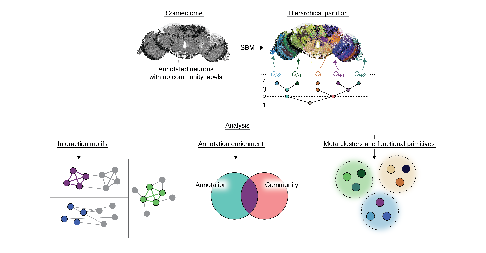

# Overview
This repository contains code and data for generating the primary results from ["Hierarchical Community Structure of the Adult Drosophila Connectome Reveals Conserved Circuit Archetypes"](https://www.biorxiv.org/content/10.64898/2025.12.10.689094v1.abstract).

## To run analyses
1. Download and unzip this repository.
2. Navigate to this [zenodo repository](https://zenodo.org/records/20399924) and download the connectome data (`connectome_no_threshold.mat` and `drosophila_adult_no_threshold.npy`) and the hierarchical community partition (`final_partition_no_threshold.npy`). Place these files in the `data/` directory.
3. Open MATLAB, navigate to the `m/` directory and execute `run_analyses.m`

## Pre-computed derivatives
Note: that `m/run_analyses.m` performs analyses to generate Figures 2-8 (Figure 1 is a schematic). The scripts for each individual figure (e.g. `figure*.m`) include some computationally intense steps. For convenience, we have run these scripts, precomputed, and saved intermediate outputs so that the most computationaly intense steps are not necessary. These are available in the `outputs/` directory. However, if you would like to run the scripts in their entirety, you can edit them so that, instead of loading in the pre-generated outputs, you compute them yourself.

We also include code (`py/sample_posterior_distribution_no_threshold.ipynb`) for estimating communities based on the [graph-tool](https://graph-tool.skewed.de/) library, as we did in the paper. This procedure is computationally intense and will take a long time, owing to the size of the connectome. If the goal is to simply reproduce the results of the main text, we strongly suggest running `run_analyses.m` using the partition from the [Zenodo dataset](https://zenodo.org/records/20399924). If you end up running the community detection process, you will need to install the graph tool library: see [here for installation instructions](https://graph-tool.skewed.de/installation.html).

## References
If you use data from this paper, please abide by FlyWire citation guidelines and cite the relevant [primary resources](https://codex.flywire.ai/about_flywire). Additionally, please cite our paper:

Betzel, R., Del Rio, O., Labora, N., Dvali, S., Larsen, B., Lynn, C. W., ... & Seguin, C. (2025). [Hierarchical Community Structure of the Adult Drosophila Connectome Reveals Conserved Circuit Archetypes](https://www.biorxiv.org/content/10.64898/2025.12.10.689094v1.abstract). _bioRxiv_, 2025-12.

All code and data are provided as is. If you have specific questions, please reach out to Rick Betzel (rbetzel@umn.edu).
